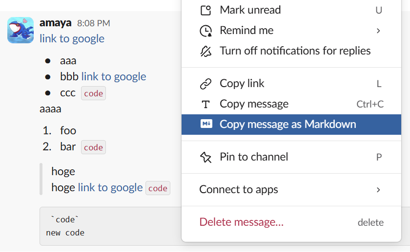
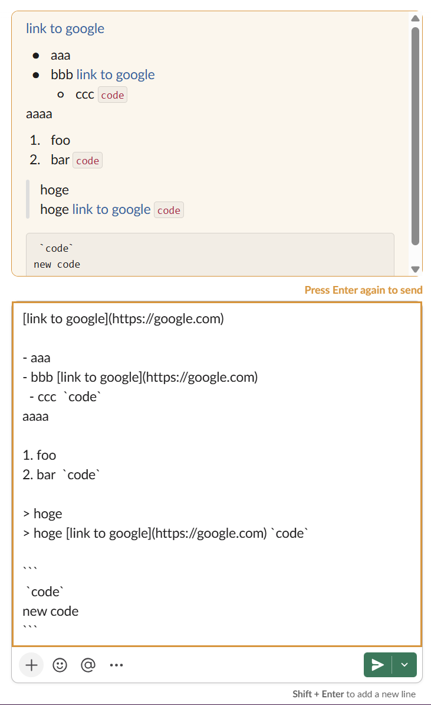

# Slack Utils

A Chrome extension that enhances your Slack experience with handy utilities.

## Features

### Copy Message as Markdown

Adds "Copy message as Markdown" and "Copy message as Markdown" options to Slack's message action menu. Converts Slack's rich text formatting (bold, italic, code blocks, lists, links, blockquotes, etc.) into clean Markdown.

Also available via the browser's right-click context menu when text is selected.

### Send Preview

Shows a rendered preview of your message before sending. Press Enter once to preview, then Enter again to confirm and send. Press Escape or edit the message to cancel.

Toggle this feature on/off from the extension popup.

## Installation

1. Clone this repository
2. Open `chrome://extensions/` in Chrome
3. Enable "Developer mode"
4. Click "Load unpacked" and select the project directory

## Permissions

- `clipboardWrite` — Copy converted Markdown to clipboard
- `contextMenus` — Add right-click context menu entry
- `storage` — Persist user preferences
